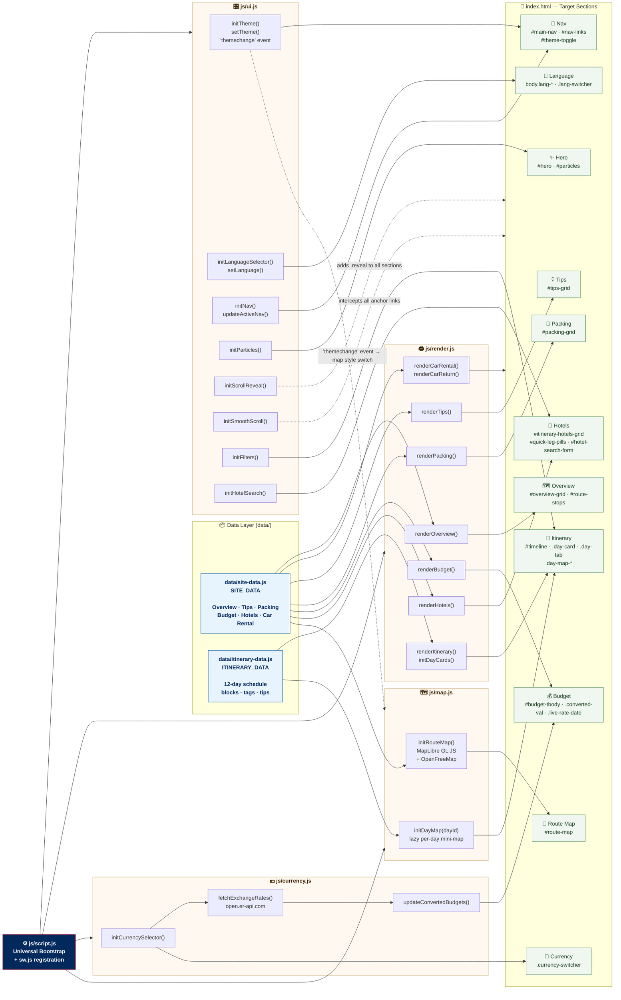

# 🗾 Japan Winter Journey 2026

**A modern, modular, interactive day-by-day family travel itinerary for Japan.**

📅 **Dec 20 – Dec 31, 2026** · 👨‍👩‍👦 **Family of 3** · 🚗 **Self-drive + Shinkansen**

---

## Route

**Tokyo** (Days 1–4) → **Kawaguchiko / Mt Fuji** (Day 5) → **Hakone** (Days 6–7) → **Nagoya** (Day 7, transit) → **Kyoto** (Days 7–9) → **Nara** (Day 10) → **Osaka** (Days 10–12)

---

## Features

- ✈️ **BA-inspired design** — Midnight Navy, BA Red & Gold palette with glassmorphism cards
- 🎨 **Modular Design System** — Centralised design tokens in `palette.css`, componentised CSS for maintainability
- ⚡ **Universal Modular Architecture** — Clean JavaScript modules supporting static hosting and local browser preview with zero build requirements
- 📱 **Progressive Web App (PWA)** — Offline support via Service Worker (`sw.js`) and installable web app manifest (`manifest.json`)
- 🌙 **Dark / Light mode toggle** — persistent across sessions via `localStorage`; maps switch styles automatically (Positron ↔ Fiord)
- 🚉 **JR Station Sign Route Board** — Authentic Japanese station sign (駅名標) timeline with Kanji, Furigana, Romaji, Station Codes & day badges
- 📅 **12 expandable day cards** with morning / afternoon / evening schedules and meal picks
- 🗺️ **Interactive route map** (MapLibre GL JS) — colour-coded route with driving, Shinkansen & rail segments
- 🗾 **Per-day mini-maps** — lazy-initialised MapLibre map inside each accordion day card
- 🎌 **Senior-friendly Bilingual Switcher** — Always-visible English & Traditional Chinese (`EN | 繁中`) toggle in top navigation bar with high-contrast tactile active pills
- 💴 **Live currency conversion** — JPY → HKD or GBP via open.er-api.com
- 🏨 **Booking.com hotel search** — pre-filled for each leg (destination, dates, 3 adults)
- 🏷️ **Region filter tabs** — Tokyo / Mt Fuji Drive / Kansai
- 📋 **Practical tips** — Transport passes, advance bookings, etiquette, winter driving
- 🧳 **Packing checklist** — winter-specific, self-drive aware
- 💰 **Budget estimate table** — per-category with live converted values
- ♿ **Accessibility (a11y)** — Full keyboard navigation (`Tab`, `Enter`, `Space`), ARIA expanded states, semantic HTML
- 📱 **Fully responsive** — pixel-aligned desktop, tablet, and mobile layouts

---

## Live Site

🔗 [View the itinerary](https://ianmahkg.github.io/IanMaHKG-2026-Japan_Planner.github.io/)

---

## Project Structure

```
├── index.html              # Semantic shell & PWA configuration
├── manifest.json           # PWA Web App Manifest
├── sw.js                   # Service Worker (offline cache & network strategies)
│
├── assets/                 # Static media and icons
│   └── favicon.svg         # SVG browser icon & PWA icon
│
├── css/                    # Modular Design System & Styles
│   ├── palette.css         # Colour tokens, typography, dark mode overrides
│   ├── base.css            # CSS reset, typography, containers, section headers
│   ├── components.css      # UI components (buttons, badges, JR signs, markers)
│   ├── sections.css        # Layouts for Hero, Map, Timeline, Hotels, Budget
│   ├── responsive.css      # Mobile, tablet, and orientation media queries
│   └── style.css           # Master orchestrator (@import manager)
│
├── data/                   # Data Modules (Universal format)
│   ├── site-data.js        # Overview, tips, packing, budget, hotels, car rental
│   └── itinerary-data.js   # 12-day schedule, blocks, location coordinates
│
└── js/                     # Application Logic (Modular scripts)
    ├── currency.js         # Exchange rate fetch, HKD/GBP conversion
    ├── map.js              # MapLibre GL JS — overview & lazy day maps
    ├── render.js           # Semantic DOM injection & accordion handling
    ├── ui.js               # Navigation, language/theme selectors, observers
    └── script.js           # Application bootstrapper & SW registration
```

### Modular Architecture Lineage Map



---

## Tech Stack

- **MapLibre GL JS** — interactive WebGL maps (open source, no API key)
- **OpenFreeMap** — free map tiles (Positron light / Fiord dark)
- **open.er-api.com** — live JPY exchange rates
- **Vanilla CSS (Modular Design System)** — custom properties, dark mode tokens, responsive layout
- **Universal JavaScript Modules & Service Worker** — zero build step, PWA offline caching
- **Google Fonts** — Inter + Noto Sans JP

---

よい旅を！*(Yoi tabi wo!)* — Have a wonderful journey! 🇯🇵